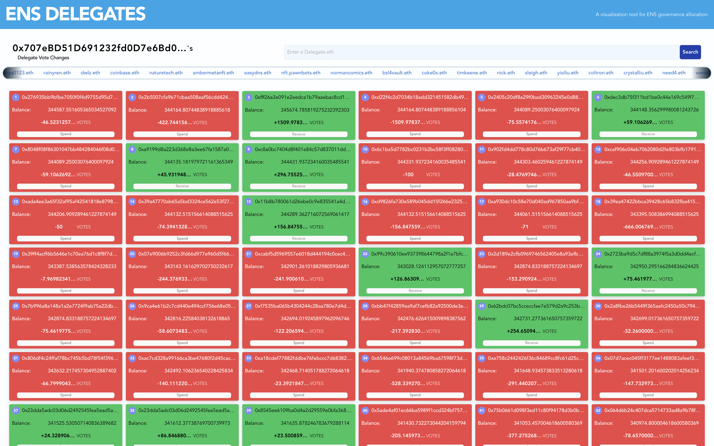

# ENS Delegates

## A visualization tool for ENS governance allocation.

Track ERC20 $ENS Token (governance vote) history of swaps and transfers of your favorite delegates.

#### STACK - Vite (React), Express, GraphQL, Ethers, Tailwindcss

---

## DEMO

## Deployed App: [https://ens-delegates.netlify.app/](https://ens-delegates.netlify.app/)